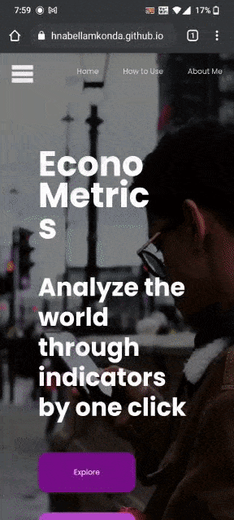
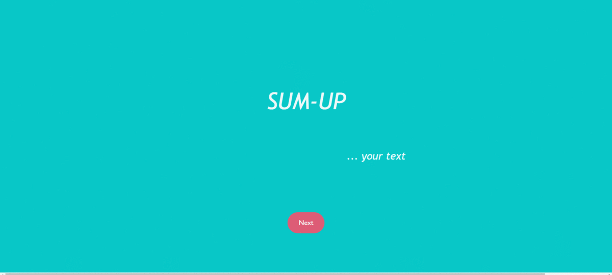
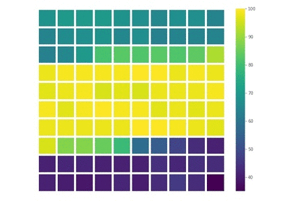

</img>

### Hi! I am Krishna Bellamkonda. The weather here is a bit Data Sciency - chances of AI/ML - but has a pleasant Front-end to it.👋

### [Personal Website](https://krishnabellamkonda.github.io/krishna-bellamkonda-portfolio/)

### Peek into my work here!
### [View this profile in a website](https://krishnabellamkonda.github.io/KrishnaBellamkonda/)

## Projects 
<table>
  <tr>
    <td><a href="https://krishnabellamkonda.github.io/econo-metrics/" style="text-decoration:none;">ECONOMETRICS</a></td>
    <td></img>
</li></td>
  </tr>
  <tr>
  
  <td>
  <a href="https://github.com/KrishnaBellamkonda/text-summarizer">TEXT SUMMARIZER</a>
  </td>

  <td>
      </img>
  </td>
  </tr>
  <tr>
  <td>
  <a href="https://github.com/KrishnaBellamkonda/wisdom-of-crowds-simulation">WISDOM OF CROWDS SIMULATION</a>

  <td>
      </img>
  </td>
  </tr>

</table>

## Other Projects
<table>
  <tr>
    <td><a href="https://github.com/KrishnaBellamkonda/wildfire-prediction-model-building">Wildfire Simulation</a>
    </td>
  </tr>
  
  <tr>
    <td><a href="https://github.com/KrishnaBellamkonda/birthday-application-github-page">Birthday Application</a>
    </td>
  </tr>
  
  
  <tr>
    <td><a href="https://github.com/KrishnaBellamkonda/global-news-markdown-app">Global News Markdown</a>
    </td>
  </tr>
  
  <tr>
    <td><a href="https://github.com/KrishnaBellamkonda/books-toscrape-scraping">Books to Scrape</a>
    </td>
  </tr>
  

  <tr>
    <td><a href="https://github.com/KrishnaBellamkonda/mini-websites-compilation">Mini Websites Compilation</a>
    </td>
  </tr>
  

</table>

## Skills 
<h3>Front-end</h3>
<table>
<tr>
  <td>
                            React
                        </td>
                        <td>
                            JavaScript
                        </td>
                        <td>
                            HTML
                        </td>
                        <td>
                            Sass
                        </td>
</tr>
</table>

<table>
<h3>Data Science</h3>
<tr class="skills-list">
                        <td>TensorFlow</td>
                        <td>Pandas</td>
                        <td>Numpy</td>
                        <td>Sklearn</td>
                        <td>Scrapy & BeautifulSoup</td>
                        <td>Matplotlib & Seaborn</td>
</tr>
</table>
  
<table>
<h3>A.I / ML</h3>
<tr class="skills-list">
                        <td>TensorFlow</td>
                        <td>Sklearn</td>
                        <td>XGboost</td>
                        <td>Scipy</td>
                        <td>Numpy</td>
                        <td>Pandas</td>
</tr>
</table>

<h2>Take a look at whats going</h2>

This news section is dynamically updated every six hours so that you are up-to-date with the news :)

## Connect with me

<a href="https://www.linkedin.com/in/krishna-bellamkonda-a6a422208/">
</img>
</a>

<a href="https://github.com/KrishnaBellamkonda">
</img>
</a>

<!--
**KrishnaBellamkonda/KrishnaBellamkonda** is a ✨ _special_ ✨ repository because its `README.md` (this file) appears on your GitHub profile.

Here are some ideas to get you started:

- 🔭 I’m currently working on ...
- 🌱 I’m currently learning ...
- 👯 I’m looking to collaborate on ...
- 🤔 I’m looking for help with ...
- 💬 Ask me about ...
- 📫 How to reach me: ...
- 😄 Pronouns: ...
- ⚡ Fun fact: ...
-->
